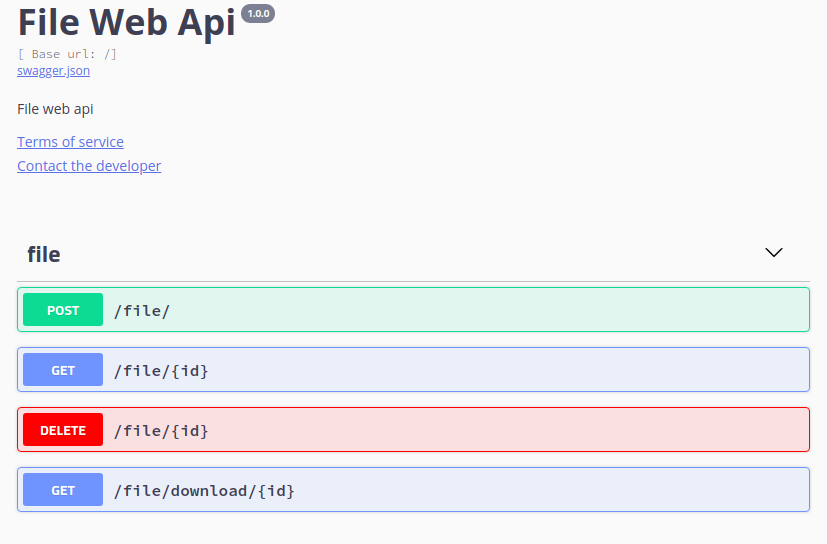

# file-service

Golang ile yazılmış, basit dosya işlemleri yapan microservice dir.


## Kurulum

```bash
$ go get github.com/zeyit/file-service
```

## Rest Api

```bash
$ go run *.go
```
Servis dokumanını görüntülemek için uygulamayı başlattıktan sonra `http://localhost:8080/swagger/` adresini açın.

[](./files/Screenshot20190623182145.png)
